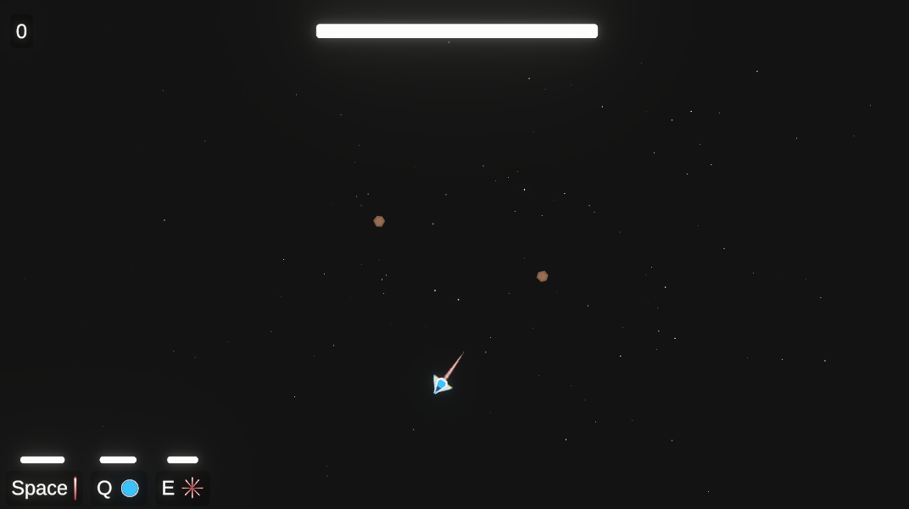

# Space Shooter
2D Unity `6000.2.6f` Space Shooter - early prototype (5+ hours of development time).

---

## Latest Gameplay Screenshots

  
  

---

## Controls
- Avoid the asteroids that are flying toward you and shoot them down.
- **Space** - Shoot a laser which haunts the asteriods.
- **Q** - Deploys a bomb.
- **E** - Shoots a circle of lasers around the ship.

---

## Roughly planned for the future
- In-game currency
- Upgrade system
- Level system for the weapons and utitlies
- Various customizable utilities / weapon modules
- Highscore
- Statistics
- Different game modes
- Customizable ship
- Boss waves
- Automatic weapons
- Ship upgrades (speed, health, etc.)
- Settings
- JSON serialization
- Different types of obstacles
- Added score text when an obstacle is destroyed
- UI animations
- Persistent/background scene for persistent resources (object pools, etc.)
- Multithreaded code using Unity’s Job System
- Levels
- Level editor
- Cleaner event handling
- Cleaner resource management
- Audio (SFX, soundtracks)

---

## Day 1 Gameplay Screenshots

  
  
  
  

